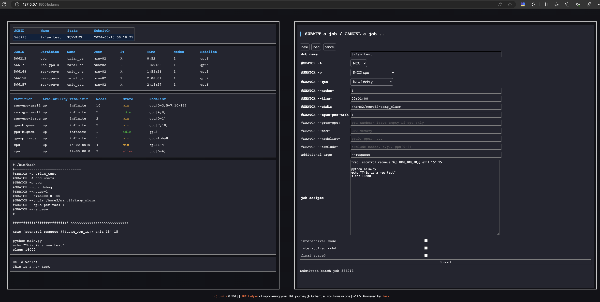
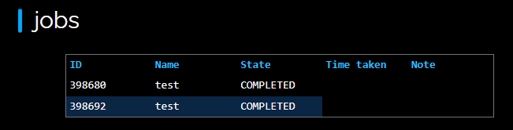

# HPC Slurm Helper

> **_NOTE:_** This is NOT the official helper for any HPC. Use at your own risk.

## Installation

1. Clone the repo `git clone https://github.com/l1997i/slurm_hpc_helper`. Run `cd slurm_gui`.

2. Run `bash install.sh` to install.

3. Modify the config and command in `src/templates/bash`, e.g., change `receipt_addr` and conda environment, etc.

4. Set the password with `python reset_password.py <your password>`.

5. Open `config.json` in the root folder, and set the `defaults.account` field to your slurm project/account id, and `defaults.home_folder` to your actual home folder.

## Usage

1. Start the app with `python main.py`.

2. Go to `https://127.0.0.1:15001/`. Log in and go to "slurm".

> **_NOTE:_**  If the page does not load completely, please reload it

3. Click "new" button to open the form for submitting jobs. Fill out the form and click "submit" to submit the job to slurm. All **required** settings are in **bold**.



4. Inspect the submitted job by selecting it in the list.



5. You can also load a previous submit job using `load` button. Fill in the `json` file path of your previous job.

6. To cancel a job that is pending or running, select the job and click the 'cancel' button. You can only cancel the job (with helper GUI) which is submitted using this helper.

## Default Log files

Log location: `${chdir}/.logs`
```txt
- job_scripts/                      - all your submitted jobs.
- job_scripts/$JOBID/$JOBID.sh      - the submitted slurm script.
- job_scripts/$JOBID/$JOBID.json    - the submitted job settings. You can upload this to retrieve the configuration of previous job.
- job_scripts/$JOBID/job_info.json  - the submitted job info, including where output and scripts are saved.
- runner/                           - code tunnel logs.
```

## Acknowledgements
We would like to additionally thank the authors the open source codebase [slurm_gui](https://github.com/eri24816/slurm_gui).